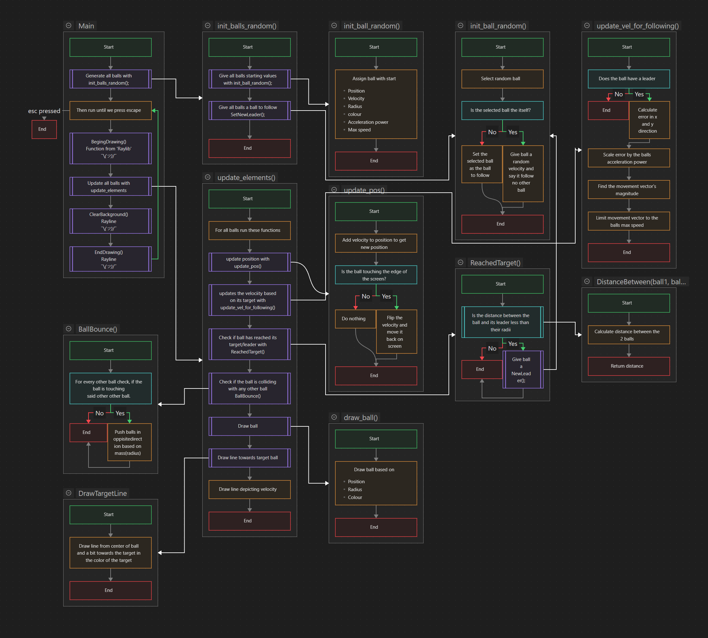

# FrankenText

The [Problem](#Problem)

The [Requirements](#Requirements)

The [main.c](.src/main.c)

[Changes](#Changes) made.

Assingment: https://c-programming.aydos.de/week09.html

# Learning goals

- Vse struct and union
- Explain the trade-offs of using struct vs arrays
- Implement self-referencing data structures
- Use typedef to shorten struct definitions
- Integrate and use an external library

# Problem

Let’s build a graphical simulation with lots of moving balls where they randomly follow each other, because they like or admire each other.
Because the balls follow each other, at some point they should end up at the same position.

# Requirements

- A ball has a two-dimensional position (posx and posy), a velocity (velx and vely), a radius (radius), a color (Color color, where Color is defined by raylib) and a pointer to another leading ball (follows).
- Select meaningful types for these properties.
- Each ball starts at a random position, with a random velocity, random color and a random ball to follow. A ball should not follow itself.
- Use the template and only fill the missing parts.
- Include a [flowchart](#Flowchart).
- Do not include raylib library in your repository.
- Record a 5-10s video of your simulation.

# Flowchart

Flowchart : 

# Example

[]

# Changes

- Made new functions
  - SetNewLeader() - Changes who the ball is follow to a random new one
  - DrawTargetLine() - Draws a line towards the current target/leader
  - DistanceBetween() - returns the distance between to balls
  - ReachedTraget() - Checks if the leader should be swapped
  - Ballbounce() - Made the ball bounce of each other. (Really inefficient)

- Changed some other small things outside the "your code here" area.
  - My prefered naming convetions-
  - Extra new lines to make text easier to read in console.
  - Added more definitions

- Allow balls to "follow" themself. This adds some nice variety to the simulation.

- Recorded as much video as i could get to fit under 5 Mb.